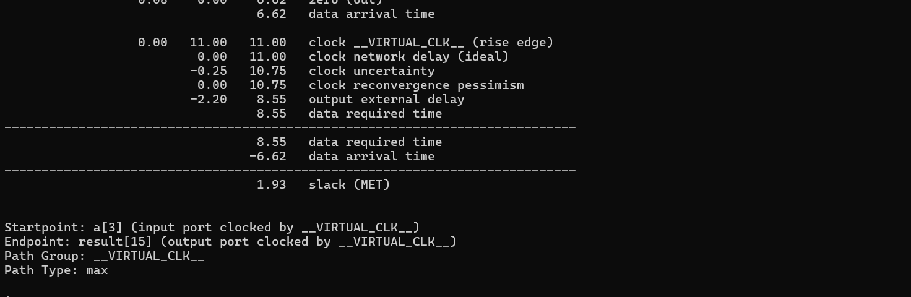
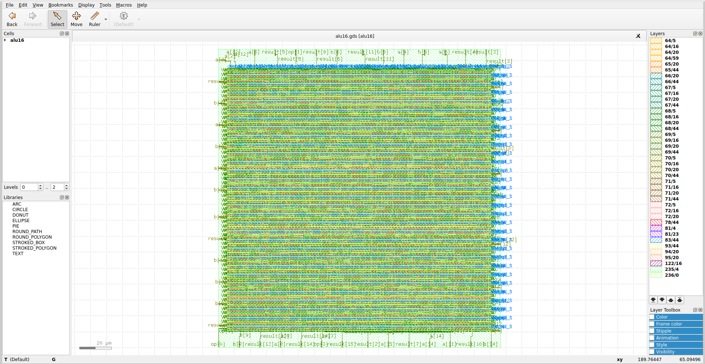
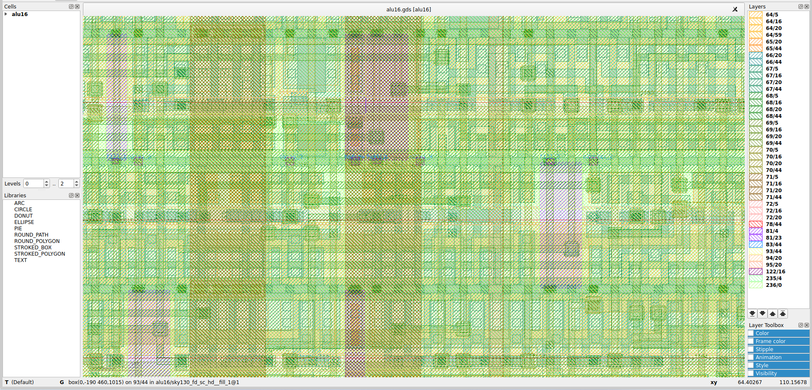

# 🚀 PPA Characterization and Optimization of a 16-bit ALU using OpenLane (Sky130)

## 📌 Project Overview

This project demonstrates a complete **RTL-to-GDSII ASIC physical design flow** of an advanced 16-bit ALU using the open-source toolchain:

- OpenLane  
- OpenROAD  
- Sky130 HD Standard Cell Library
  
## 📊 Final PPA Summary (Post-Route Signoff)

| Metric | Value |
|--------|-------|
| Technology | Sky130 |
| Clock Period | 11 ns |
| Worst Slack (WNS) | +1.93 ns |
| Timing Status | ✅ MET |
| Flow | OpenLane RTL-to-GDS |
All setup timing constraints are met at 11 ns with positive slack under typical corner analysis.
### Objective

🔍 Perform quantitative **Power-Performance-Area (PPA)** characterization and analyze trade-offs under different clock constraints and synthesis strategies.

---

## 🧠 ALU Architecture

The 16-bit ALU supports:

| Opcode | Operation |
|--------|-----------|
| 0000 | ADD |
| 0001 | SUB |
| 0010 | AND |
| 0011 | OR |
| 0100 | XOR |
| 0101 | MUL |
| 0110 | SHIFT LEFT |
| 0111 | SHIFT RIGHT |
| 1000 | LESS THAN |

The multiplier introduces deeper combinational paths, enabling meaningful timing optimization experiments.

---

## 🛠 Tool Flow
RTL → Synthesis → Floorplan → Placement → CTS → Routing → RC Extraction → STA → Power Analysis → GDSII

### Tools Used
- Yosys (Synthesis)
- OpenROAD (Placement, CTS, Routing)
- OpenSTA (Signoff STA)
- Sky130A PDK

---

## 📊 PPA Characterization Experiments

### 🟢 Run 1 – Baseline (AREA Strategy, 12ns Clock)

**Configuration**
- CLOCK_PERIOD = 12ns  
- SYNTH_STRATEGY = AREA  

**Results**
- Critical Path: 6.26 ns  
- WNS: 0.0 ns  
- Core Area: 17,779 µm²  
- Total Cells: 2,751  
- Total Power: ~0.000744 W  

✔ Clean timing  
✔ Lowest power  

---

### 🔴 Run 2 – Tightened Clock (AREA Strategy, 11ns)

**Results**
- Critical Path: 6.21 ns  
- WNS: -0.59 ns (Setup violation)  
- Power: ~0.000819 W  

⚠ Timing violation observed  

---

### 🔵 Run 3 – Performance Optimization (DELAY 2 Strategy, 11ns)

**Configuration**
- CLOCK_PERIOD = 11ns  
- SYNTH_STRATEGY = DELAY 2  

**Results**
- Critical Path: 4.42 ns  
- WNS: 0.0 ns  
- Core Area: 26,950 µm²  
- Total Cells: 3,771  
- Total Power: ~0.00187 W  

✔ Timing closed  
⚠ Area ↑ 51%  
⚠ Power ↑ significantly  

---

## 📈 PPA Comparison Summary

| Clock | Strategy | Critical Path | WNS | Area (µm²) | Power (W) | Status |
|--------|----------|---------------|------|------------|------------|--------|
| 12ns | AREA | 6.26ns | 0 | 17,779 | 0.000744 | PASS |
| 11ns | AREA | 6.21ns | -0.59 | 17,779 | 0.000819 | FAIL |
| 11ns | DELAY 2 | 4.42ns | 0 | 26,950 | 0.00187 | PASS |

---

## 🔍 Key Insights

1️⃣ Speed vs Area Tradeoff  
2️⃣ Speed vs Power Tradeoff  
3️⃣ Area Optimization Limits Frequency  
4️⃣ Synthesis Strategy Impacts Timing Closure  

---

## 🎯 Learning Outcomes

- RTL-to-GDSII backend flow  
- Static Timing Analysis (STA)  
- Setup violation debugging  
- Timing closure techniques  
- PPA trade-off analysis  
- Signoff report interpretation  

---

## 📁 Repository Structure
rtl/ → Verilog source
config/ → OpenLane configuration
reports/ → PPA metrics
images/ → Layout snapshots
README.md → Documentation

---

## 🏁 Conclusion

This project demonstrates a realistic backend ASIC workflow and quantitatively illustrates how synthesis strategy and clock constraints impact timing, area, and power.

---

## 📬 Contact

Open to discussions on backend physical design, STA, and PPA optimization.

## ⏱️ Post-Route Timing Report

Clock Period: 11 ns  
Worst Slack (WNS): +1.93 ns  
Timing Status: MET  

## 📷 Final GDS Layout (Post-Route)

### Full Layout View

### Routing Detail View

